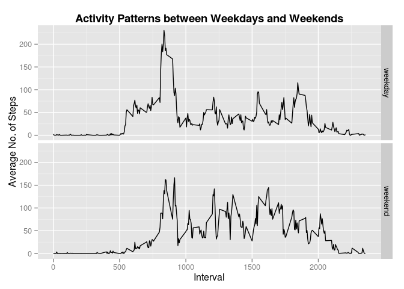

# Reproducible Research: Peer Assessment 1


## Loading and preprocessing the data
  
Remove NA values

```r
raw_activityDF <- read.csv (unz("activity.zip","activity.csv"), header=TRUE)
activityDF <- raw_activityDF [!is.na(raw_activityDF$steps),]
```


## What is mean total number of steps taken per day?  
1.  Histogram of the total number of steps taken each day

```r
sumStepsByDay <- aggregate ( steps ~ date, activityDF, sum)
hist (sumStepsByDay$steps, xlab="Total Steps", main="Histogram - Total Steps per Day")
```

 


2.  Mean total number of steps taken per day  

```r
meanSteps <- mean  (sumStepsByDay$steps)
meanSteps
```

```
## [1] 10766.19
```


3.  Median total number of steps taken per day  

```r
medianSteps <- median (sumStepsByDay$steps)
medianSteps
```

```
## [1] 10765
```
  
  

## What is the average daily activity pattern?
  
1.  Make a time series plot (i.e. type = "l") of the 5-minute interval (x-axis) and the average number of steps taken, averaged across all days (y-axis)

```r
meanStepsByInterval <- aggregate ( steps ~ interval, activityDF, mean)
plot (meanStepsByInterval$interval, meanStepsByInterval$steps, type="l")
```

 
  
  
2.  Which 5-minute interval, on average across all the days in the dataset, contains the maximum number of steps?


```r
maxInterval <- meanStepsByInterval[which.max(meanStepsByInterval$steps),"interval"]
maxInterval
```

```
## [1] 835
```
  The 835 interval contains the maximum number of steps on average across all days.
  
## Inputing missing values
  
    
1.  Calculate and report the total number of missing values in the dataset (i.e. the total number of rows with NAs)

```r
missingValues <- NROW (raw_activityDF [is.na(raw_activityDF$steps),])
missingValues
```

```
## [1] 2304
```
  
- The number of missing values in the dataset is 2304
  
2.  Devise a strategy for filling in all of the missing values in the dataset. The strategy does not need to be sophisticated. For example, you could use the mean/median for that day, or the mean for that 5-minute interval, etc.

```r
# Fill mean number of steps of 5 minute interval for missing values
colnames(meanStepsByInterval)[colnames(meanStepsByInterval)=="steps"] <- "AvgSteps"
fillActivityDF <- merge (raw_activityDF, meanStepsByInterval, by.x = "interval", by.y="interval")
```
  
  
3.  Create a new dataset that is equal to the original dataset but with the missing data filled in.

```r
fillActivityDF$steps[is.na(fillActivityDF$steps)] <- fillActivityDF[is.na(fillActivityDF$steps),"AvgSteps"]
fillActivityDF$date <- as.Date(fillActivityDF$date)
```
  
  
4.  Make a histogram of the total number of steps taken each day and Calculate and report the mean and median total number of steps taken per day.  

```r
sumStepsByDayFill <- aggregate ( steps ~ date, fillActivityDF, sum)
hist (sumStepsByDayFill$steps, xlab="Steps", main="Histogram - Total Steps per Day (NAs filled)")  
```

 


Mean total number of steps per day

```r
meanStepsFill <- mean (sumStepsByDayFill$steps)
meanStepsFill
```

```
## [1] 10766.19
```
  
  
Median total number of steps per day

```r
medianStepsFill <- median (sumStepsByDayFill$steps)
medianStepsFill <- round(medianStepsFill,2)
medianStepsFill
```

```
## [1] 10766.19
```
  

Do these values differ from the estimates from the first part of the assignment?  
- Mean is the same
- Difference in median values are negligible

What is the impact of imputing missing data on the estimates of the total daily number of steps?  
- Higher frequency (observations) of daily number of steps since there are 2304 observations now filled in.
  
  
## Are there differences in activity patterns between weekdays and weekends?
  
  
1.  Create a new factor variable in the dataset with two levels -- "weekday" and "weekend" indicating whether a given date is a weekday or weekend day.

```r
fillActivityDF$day <- weekdays (fillActivityDF$date)
fillActivityDF$dayType <- ifelse (weekdays (fillActivityDF$date) %in% c("Saturday","Sunday") ,"weekend","weekday")
fillActivityDF$dayType <- as.factor(fillActivityDF$dayType)
```

2.  Make a panel plot containing a time series plot (i.e. type = "l") of the 5-minute interval (x-axis) and the average number of steps taken, averaged across all weekday days or weekend days (y-axis).


```r
meanStepsByIntDayType <- aggregate ( steps ~ dayType + interval, fillActivityDF, mean)

library (ggplot2)

p1 <- ggplot(data=meanStepsByIntDayType, aes(x=interval, y=steps)) + geom_line()  
p1 <- p1 + xlab("Interval") + ylab("Average No. of Steps") 
p1 <- p1 + facet_grid(dayType ~ .)
p1 <- p1 + ggtitle("Activity Patterns between Weekdays and Weekends") + theme (plot.title=element_text( size=14, face="bold"))    

p1
```

 
